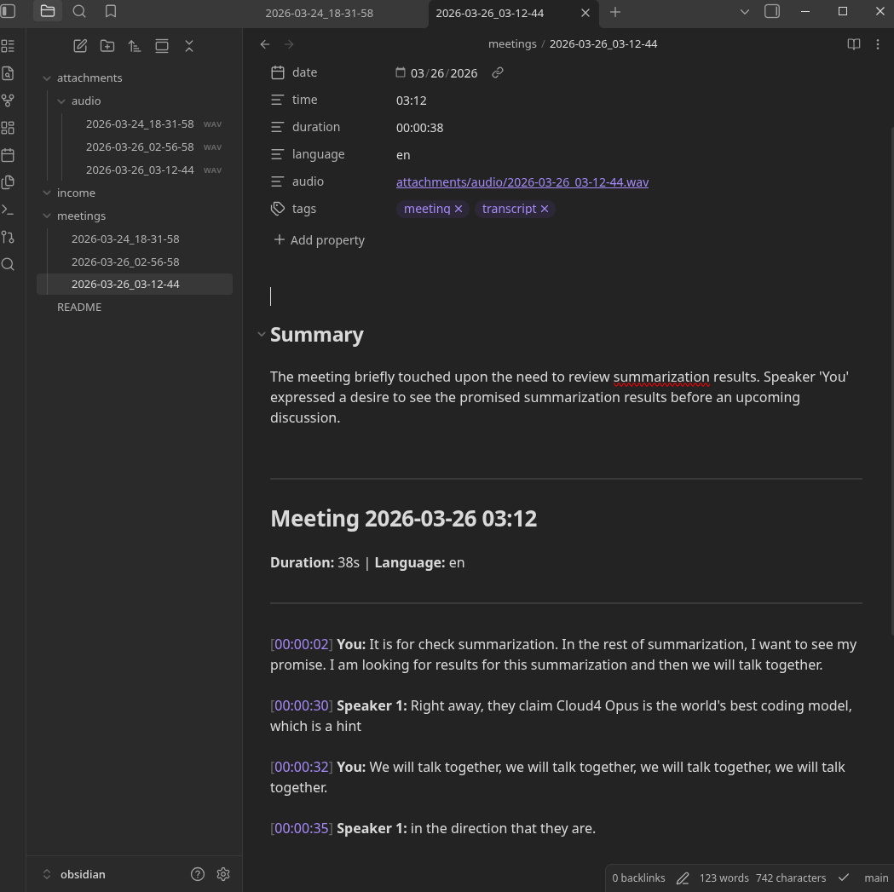

# tapeback

Local meeting recorder for Linux. Records system audio + microphone via
PipeWire/PulseAudio, transcribes with Whisper, identifies speakers, saves
Markdown to your Obsidian vault. Everything runs on your machine, no cloud
services or API calls needed for transcription.

Works with any video call platform: Google Meet, Zoom, Teams, Telegram, Discord, Slack huddles.



## Features

- **Platform-agnostic**: captures OS-level audio, works with any app
- **Local transcription**: faster-whisper on CPU or CUDA GPU
- **Speaker diarization**: pyannote identifies who said what
- **Stereo channel separation**: your mic (left) vs. others (right) for accurate "You" attribution
- **Obsidian-native output**: Markdown with YAML frontmatter, wikilinks to audio files
- **LLM summarization**: Anthropic, OpenAI, Groq, Gemini, DeepSeek, OpenRouter, Qwen (with automatic provider fallback)
- **System tray**: start/stop recording from the tray icon, no terminal needed
- **CLI-first**: `tapeback start`, Ctrl+C to stop, done

tapeback is modular — the base package handles recording and transcription.
Speaker diarization and LLM summaries are optional and installed separately.

## Installation

### Arch Linux (AUR)

```bash
yay -S tapeback                              # recording + transcription
yay -S tapeback tapeback-tray                # + system tray icon
yay -S tapeback tapeback-llm                 # + LLM summaries
yay -S tapeback tapeback-diarize             # + speaker diarization
yay -S tapeback tapeback-tray tapeback-llm tapeback-diarize  # everything
```

All system dependencies (ffmpeg, PipeWire) are installed automatically.

### pip / uv

Install system dependencies first:

```bash
# Arch / Manjaro
sudo pacman -S python uv ffmpeg pipewire-pulse

# Ubuntu / Debian
sudo apt install python3 pipx ffmpeg pulseaudio-utils

# Fedora
sudo dnf install python3 pipx ffmpeg pipewire-pulseaudio
```

Then install tapeback:

```bash
uv tool install tapeback                          # recording + transcription
uv tool install "tapeback[tray]"                  # + system tray icon
uv tool install "tapeback[llm]"                   # + LLM summaries
uv tool install "tapeback[diarize]"               # + speaker diarization
uv tool install "tapeback[tray,llm,diarize]"      # everything
```

<details>
<summary>pipx or Nix</summary>

```bash
# pipx
pipx install tapeback
pipx install "tapeback[tray,llm,diarize]"         # everything

# Nix
nix run github:yastcher/tapeback                  # basic
nix run github:yastcher/tapeback#tray             # + system tray icon
nix run github:yastcher/tapeback#llm              # + LLM summaries
nix run github:yastcher/tapeback#diarize          # + speaker diarization
nix run github:yastcher/tapeback#full             # everything
```

</details>

## Quick start

```bash
tapeback start                     # start recording, Ctrl+C to stop
```

That's it. The transcript is saved to `~/tapeback/meetings/`.

To save to your Obsidian vault instead:

```bash
mkdir -p ~/.config/tapeback
echo 'TAPEBACK_VAULT_PATH=~/Documents/obsidian/vault' > ~/.config/tapeback/.env
```

## System tray

Run without a terminal — right-click the tray icon to start/stop recording:

```bash
tapeback tray
```

Icon color shows the current state:
**gray** = idle, **red** = recording, **orange** = processing.

To autostart on login, create `~/.config/autostart/tapeback-tray.desktop`:

```ini
[Desktop Entry]
Name=tapeback
Exec=tapeback tray
Type=Application
X-GNOME-Autostart-enabled=true
```

Works on any XDG-compatible desktop (KDE, GNOME, Hyprland, Sway, etc.).

## Speaker diarization

Speaker diarization identifies who said what in the recording. Without it,
tapeback uses stereo channels: your mic is labeled "You", everything else
is labeled "Other".

To enable diarization, you need a HuggingFace token with access to pyannote models:

1. Create account at [huggingface.co](https://huggingface.co)
2. Accept license at [pyannote/speaker-diarization-3.1](https://huggingface.co/pyannote/speaker-diarization-3.1)
3. Accept license at [pyannote/segmentation-3.0](https://huggingface.co/pyannote/segmentation-3.0)
4. Create token at [huggingface.co/settings/tokens](https://huggingface.co/settings/tokens)
5. Add to `~/.config/tapeback/.env`:

```bash
TAPEBACK_HF_TOKEN=hf_your_token_here
```

> First run downloads the pyannote model (~1 GB). An NVIDIA GPU is strongly
> recommended — diarization on CPU is very slow.

## LLM summarization

After transcription, tapeback can add a brief summary, action items, and key
decisions using an LLM.

Set an API key for at least one provider in `~/.config/tapeback/.env`:

```bash
TAPEBACK_LLM_PROVIDER=gemini
GEMINI_API_KEY=...
```

| Provider | Env var | Default model |
|---|---|---|
| `anthropic` | `ANTHROPIC_API_KEY` | claude-sonnet-4-20250514 |
| `openai` | `OPENAI_API_KEY` | gpt-4o |
| `groq` | `GROQ_API_KEY` | llama-3.3-70b-versatile |
| `gemini` | `GEMINI_API_KEY` | gemini-2.5-flash |
| `openrouter` | `OPENROUTER_API_KEY` | google/gemini-2.5-flash:free |
| `deepseek` | `DEEPSEEK_API_KEY` | deepseek-chat |
| `qwen` | `DASHSCOPE_API_KEY` | qwen-turbo |

If the primary provider fails, tapeback automatically tries the next available
provider (any provider with an API key set).

## CLI reference

```
tapeback start [NAME]              Start recording (Ctrl+C to stop)
tapeback stop                      Stop recording from another terminal
tapeback tray                      System tray icon
tapeback process <FILE> [--name N] Transcribe an existing audio file
tapeback summarize <FILE>          Add LLM summary to transcript
tapeback status                    Show recording status and settings
```

```bash
tapeback start --no-diarize        # skip speaker identification
tapeback start --no-summarize      # skip LLM summary
tapeback process meeting.mp3 --name "weekly-standup"
tapeback summarize notes.md --provider gemini --model gemini-2.5-pro
```

## Output format

```markdown
---
date: 2026-03-23
time: "14:30"
duration: "01:23:45"
language: en
tags:
  - meeting
  - transcript
---

## Summary

Brief overview of the meeting.

### Action Items

- [ ] **You:** Send the report by Friday
- [ ] **Speaker 1:** Review the PR

### Key Decisions

- Use PostgreSQL instead of MongoDB

---

# Meeting 2026-03-23 14:30

![[attachments/audio/2026-03-23_14-30-00.wav]]

[00:00:01] **You:** Hello, let's start with the backend changes.

[00:01:23] **Speaker 1:** Sure, I have the slides ready.

[00:02:45] **Speaker 2:** Can we start with the backend changes?
```

<details>
<summary><h2>Configuration reference</h2></summary>

All settings via environment variables (prefix `TAPEBACK_`) or
`~/.config/tapeback/.env` file.

### Core

| Variable | Default | Description |
|---|---|---|
| `TAPEBACK_VAULT_PATH` | `~/tapeback` | Path to output directory (Obsidian vault) |
| `TAPEBACK_MEETINGS_DIR` | `meetings` | Subdirectory for meeting notes |
| `TAPEBACK_ATTACHMENTS_DIR` | `attachments/audio` | Subdirectory for audio files |

### Transcription

| Variable | Default | Description |
|---|---|---|
| `TAPEBACK_WHISPER_MODEL` | `large-v3-turbo` | Whisper model (`tiny`, `base`, `small`, `medium`, `large-v3-turbo`) |
| `TAPEBACK_LANGUAGE` | `en` | Transcription language code |
| `TAPEBACK_DEVICE` | `cuda` | `cuda` or `cpu` |
| `TAPEBACK_COMPUTE_TYPE` | `auto` | `auto`, `float16`, `int8`, or `float32` (`auto` picks `int8` when free VRAM < 4 GiB) |
| `TAPEBACK_BEAM_SIZE` | `5` | Whisper beam search width |
| `TAPEBACK_PAUSE_THRESHOLD` | `1.0` | Seconds; split segments on silence gaps >= this |

### Audio

| Variable | Default | Description |
|---|---|---|
| `TAPEBACK_MONITOR_SOURCE` | `auto` | PulseAudio monitor source name |
| `TAPEBACK_MIC_SOURCE` | `auto` | PulseAudio mic source name |
| `TAPEBACK_SAMPLE_RATE` | `48000` | Recording sample rate |

### Speaker diarization

| Variable | Default | Description |
|---|---|---|
| `TAPEBACK_DIARIZE` | `true` | Enable speaker diarization |
| `TAPEBACK_HF_TOKEN` | *(empty)* | HuggingFace token ([setup](#speaker-diarization)) |
| `TAPEBACK_MAX_SPEAKERS` | *(auto)* | Maximum number of speakers |
| `TAPEBACK_SPECTRAL_MERGE_THRESHOLD` | `0.96` | Spectral speaker merging (0 = off; lower merges more aggressively) |

### LLM summarization

| Variable | Default | Description |
|---|---|---|
| `TAPEBACK_SUMMARIZE` | `true` | Enable LLM summarization |
| `TAPEBACK_LLM_PROVIDER` | `anthropic` | Primary provider ([list](#llm-summarization)) |
| `TAPEBACK_LLM_API_KEY` | *(empty)* | API key (or use provider-specific env var) |
| `TAPEBACK_LLM_MODEL` | *(provider default)* | Override model name |

</details>

## Uninstall

```bash
# Arch Linux
yay -R tapeback tapeback-tray tapeback-diarize tapeback-llm

# pip / uv
uv tool uninstall tapeback

# Remove cached ML models (~2-5 GB)
# Skip if you use HuggingFace for other projects
rm -rf ~/.cache/huggingface/
```

## Roadmap

- **Speaker profiles**: learn and remember recurring speakers across meetings
- **Real-time transcription**: live streaming with partial results
- **Multi-language meetings**: detect and handle language switches mid-meeting
- **Windows support**: WASAPI loopback capture

## Support

If you find tapeback useful, consider a small donation:

| USDT (TRC-20) | ADA (Cardano) |
|:-:|:-:|
|  |  |
| `TAECw9FebnoSN2n3H2Fk9Bv5aA8fwpCuBB` | `addr1q9tqg2g8wxpxawsrvea84lms3ampuda0ygzawuxq77sxwr48mxj2vq2rzd4nsmhpdhy6lftp30tz78tetzr29mtvkqmsskrmp7` |

## License

Apache-2.0. See [LICENSE](LICENSE).
