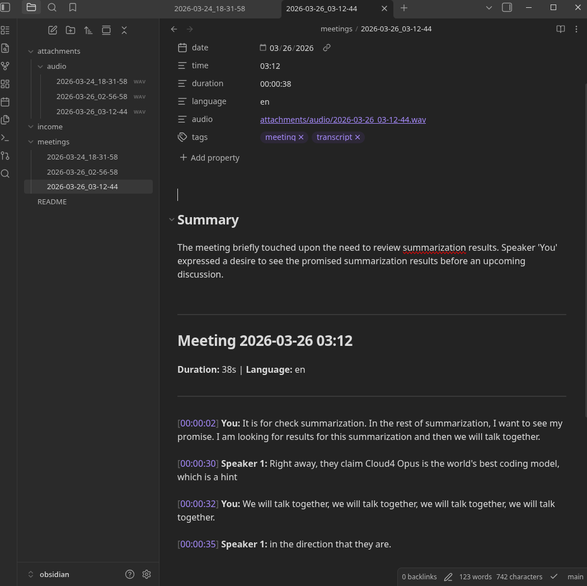

# tapeback

Local meeting recorder for Linux. Records system audio + microphone via
PipeWire/PulseAudio, transcribes with Whisper, identifies speakers, saves
Markdown to your Obsidian vault. Everything runs on your machine, no cloud
services or API calls needed for transcription.

Works with any video call platform: Google Meet, Zoom, Teams, Telegram, Discord, Slack huddles.



## Features

- **Live transcription** (opt-in): read the transcript while the meeting is still going — Whisper transcribes in the background every 60 seconds (set `TAPEBACK_LIVE=true`)
- **Platform-agnostic**: captures OS-level audio, works with any app
- **Local transcription**: faster-whisper on CPU or CUDA GPU
- **Speaker diarization**: pyannote identifies who said what
- **Stereo channel separation**: your mic (left) vs. others (right) for accurate "You" attribution
- **Obsidian-native output**: Markdown with YAML frontmatter, wikilinks to audio files
- **LLM summarization**: Anthropic, OpenAI, Groq, Gemini, DeepSeek, OpenRouter, Qwen (with automatic provider fallback)
- **System tray**: start/stop recording from the tray icon, no terminal needed
- **CLI-first**: `tapeback start`, Ctrl+C to stop, done

tapeback is modular — the base package handles recording and transcription.
Speaker diarization and LLM summaries are optional and installed separately.

## Installation

### Arch Linux (AUR)

```bash
yay -S tapeback                              # recording + transcription
yay -S tapeback tapeback-tray                # + system tray icon
yay -S tapeback tapeback-llm                 # + LLM summaries
yay -S tapeback tapeback-diarize             # + speaker diarization
yay -S tapeback tapeback-cuda                # + GPU transcription on CUDA 13 systems
yay -S tapeback tapeback-tray tapeback-llm tapeback-diarize tapeback-cuda  # everything
```

All system dependencies (ffmpeg, PipeWire) are installed automatically.

### Ubuntu / Debian (.deb)

Pre-built `.deb` packages are attached to every
[GitHub Release](https://github.com/yastcher/tapeback/releases). Pick a version
(see the releases page for the current one), download, install:

```bash
wget https://github.com/yastcher/tapeback/releases/download/v0.9.8/tapeback_0.9.8_amd64.deb
sudo apt install ./tapeback_0.9.8_amd64.deb

# Optional extras:
sudo apt install ./tapeback-tray_0.9.8_all.deb       # tray icon
sudo apt install ./tapeback-llm_0.9.8_all.deb        # LLM summaries
sudo apt install ./tapeback-diarize_0.9.8_all.deb    # speaker diarization
sudo apt install ./tapeback-cuda_0.9.8_all.deb       # GPU transcription on CUDA 13
```

The base package bundles its own Python interpreter (from
[python-build-standalone](https://github.com/astral-sh/python-build-standalone))
so it works on any modern Ubuntu or Debian regardless of the system Python
version. Only system dependencies are `ffmpeg` and `pulseaudio-utils` (for
`parecord` / `pactl`).

### pip / uv

Install system dependencies first:

```bash
# Arch / Manjaro
sudo pacman -S python uv ffmpeg pipewire-pulse

# Ubuntu / Debian
sudo apt install python3 pipx ffmpeg pulseaudio-utils

# Fedora
sudo dnf install python3 pipx ffmpeg pipewire-pulseaudio
```

Then install tapeback:

```bash
uv tool install tapeback                          # recording + transcription
uv tool install "tapeback[tray]"                  # + system tray icon
uv tool install "tapeback[llm]"                   # + LLM summaries
uv tool install "tapeback[diarize]"               # + speaker diarization
uv tool install "tapeback[tray,llm,diarize]"      # everything
```

### pipx or Nix

```bash
# pipx
pipx install tapeback
pipx install "tapeback[tray,llm,diarize]"         # everything

# Nix
nix run github:yastcher/tapeback                  # basic
nix run github:yastcher/tapeback#tray             # + system tray icon
nix run github:yastcher/tapeback#llm              # + LLM summaries
nix run github:yastcher/tapeback#diarize          # + speaker diarization
nix run github:yastcher/tapeback#full             # everything
```

## Quick start

```bash
tapeback start                     # start recording, Ctrl+C to stop
```

That's it. The transcript is saved to `~/tapeback/meetings/`.

To save to your Obsidian vault instead:

```bash
mkdir -p ~/.config/tapeback
echo 'TAPEBACK_VAULT_PATH=~/Documents/obsidian/vault' > ~/.config/tapeback/.env
```

**Tip:** if you always meet in one language, pin it — auto-detection can misfire on a
channel that starts silent (and even hallucinate). English terms inside another language
still transcribe fine:

```bash
TAPEBACK_LANGUAGE=en tapeback start          # or add TAPEBACK_LANGUAGE=en to .env
```

## System tray

Run without a terminal — right-click the tray icon to start/stop recording:

```bash
tapeback tray
```

Icon color shows the current state:
**gray** = idle, **red** = recording, **orange** = processing.

To autostart on login, create `~/.config/autostart/tapeback-tray.desktop`:

```ini
[Desktop Entry]
Name=tapeback
Exec=tapeback tray
Type=Application
X-GNOME-Autostart-enabled=true
```

tapeback's tray speaks the StatusNotifierItem D-Bus protocol directly — no
pystray, no GTK, no XEmbed. KDE Plasma, Hyprland (with waybar), and Sway
(with waybar/eww) display it out of the box on both X11 and Wayland.

### GNOME

GNOME Shell does not display SNI items natively. Install the
**AppIndicator Support** extension (one-time setup, also needed by Slack,
Dropbox, etc.):

```bash
# Ubuntu / Debian
sudo apt install gnome-shell-extension-appindicator
# Fedora
sudo dnf install gnome-shell-extension-appindicator
```

Open the **Extensions** app, enable **Ubuntu AppIndicators** (or
**AppIndicator and KStatusNotifierItem Support**), log out + back in.
`tapeback tray` prints this hint to stderr on startup if it detects an
affected session. See [issue #3](https://github.com/yastcher/tapeback/issues/3)
for background.

## Speaker diarization

Speaker diarization identifies who said what in the recording. Without it,
tapeback uses stereo channels: your mic is labeled "You", everything else
is labeled "Other".

To enable diarization, you need a HuggingFace token with access to pyannote models:

1. Create account at [huggingface.co](https://huggingface.co)
2. Accept license at [pyannote/speaker-diarization-3.1](https://huggingface.co/pyannote/speaker-diarization-3.1)
3. Accept license at [pyannote/segmentation-3.0](https://huggingface.co/pyannote/segmentation-3.0)
4. Create token at [huggingface.co/settings/tokens](https://huggingface.co/settings/tokens)
5. Add to `~/.config/tapeback/.env`:

```bash
TAPEBACK_HF_TOKEN=hf_your_token_here
```

> First run downloads the pyannote model (~1 GB). An NVIDIA GPU is strongly
> recommended — diarization on CPU is very slow.

## LLM summarization

After transcription, tapeback can add a brief summary, action items, and key
decisions using an LLM.

Set an API key for at least one provider in `~/.config/tapeback/.env`:

```bash
TAPEBACK_LLM_PROVIDER=gemini
GEMINI_API_KEY=...
```

| Provider | Env var | Default model |
|---|---|---|
| `anthropic` | `ANTHROPIC_API_KEY` | claude-sonnet-4-20250514 |
| `openai` | `OPENAI_API_KEY` | gpt-4o |
| `groq` | `GROQ_API_KEY` | llama-3.3-70b-versatile |
| `gemini` | `GEMINI_API_KEY` | gemini-2.5-flash |
| `openrouter` | `OPENROUTER_API_KEY` | google/gemini-2.5-flash:free |
| `deepseek` | `DEEPSEEK_API_KEY` | deepseek-chat |
| `qwen` | `DASHSCOPE_API_KEY` | qwen-turbo |

If the primary provider fails, tapeback automatically tries the next available
provider (any provider with an API key set).

### PII masking

Summarization is the only thing tapeback sends off the machine — recording,
transcription and diarization are all local. If that request bothers you, either
leave summarization off (`TAPEBACK_SUMMARIZE=false`, and nothing is ever sent) or
turn on masking:

```bash
TAPEBACK_MASK_PII=true
```

Emails and phone numbers are then replaced with `[EMAIL_1]` / `[PHONE_1]`
placeholders before the transcript is sent — including on the retry and on every
fallback provider — and the real values are restored in the summary saved to your
vault. The transcript on disk is never masked.

**Add the names yourself.** Whisper writes what people say, and what people say
aloud in meetings is names, not email addresses — so on a typical transcript the
two built-in rules match nothing at all. The part that carries is your own list:

```bash
TAPEBACK_MASK_TERMS=Ivan Petrov,Ivan,Acme Corp,Project Gemini
```

Matching is case-insensitive and word-bounded (`Ann` is not masked inside `Anna`),
and the longest term wins, so listing both `Ivan Petrov` and `Ivan` is fine.
Terms that collide with a transcript label (`You`, `Other`, `Speaker 1`) are
refused with a warning — masking those would break speaker attribution and protect
nothing.

**Matching is literal.** A term is masked in exactly the forms you list. In an
inflected language every form needs its own entry (`Ivan, Ivana, Ivanu`) — tapeback
does not guess them, because guessing would silently rewrite unrelated words.
`TAPEBACK_MASK_PII=true` is a floor, not a guarantee that the provider sees nothing
personal.

**Check it before you trust it.** `--show-masked` prints exactly what would be sent
and stops there — no request, no API key needed:

```bash
tapeback summarize notes.md --show-masked
# stderr: Masked: EMAIL 1, TERM 4
# stdout: the text that would go to the provider
```

The tally counts distinct values, not occurrences. The payload goes to stdout and
the tally to stderr, so `--show-masked > sent.txt` gives you something to diff.

## CLI reference

```
tapeback start [NAME]              Start recording (Ctrl+C to stop)
tapeback stop                      Stop recording from another terminal
tapeback tray                      System tray icon
tapeback process <FILE> [--name N] Transcribe an existing audio file
tapeback summarize <FILE>          Add LLM summary to transcript
tapeback status                    Show recording status and settings
```

```bash
tapeback start --no-live           # one-shot override: skip live transcription even if TAPEBACK_LIVE=true
tapeback start --no-diarize        # skip speaker identification
tapeback start --no-summarize      # skip LLM summary
tapeback process meeting.mp3 --name "weekly-standup"
tapeback summarize notes.md --provider gemini --model gemini-2.5-pro
tapeback summarize notes.md --show-masked   # print what would be sent, send nothing
```

## Output format

Stereo recordings produce two transcript sections:
- **Transcript** — raw Whisper output with channel-based labels (You / Other)
- **Diarized Transcript** — speaker-identified output (You / Speaker 1 / Speaker 2 / ...)

Words where Whisper is uncertain (probability < 0.5) are shown in *italics*.

```markdown
---
date: 2026-03-23
time: "14:30"
duration: "01:23:45"
language: en
audio: "[[attachments/audio/2026-03-23_14-30-00.wav]]"
tags:
  - meeting
  - transcript
---

## Summary

Brief overview of the meeting.

### Action Items

- [ ] **You:** Send the report by Friday
- [ ] **Speaker 1:** Review the PR

### Key Decisions

- Use PostgreSQL instead of MongoDB

---
# Meeting 2026-03-23 14:30

**Duration:** 1h 23m 45s | **Language:** en

---

## Transcript

[00:00:01] **You:** Hello, let's start with the *backend* changes.

[00:01:23] **Other:** Sure, I have the slides ready.

---

## Diarized Transcript

[00:00:01] **You:** Hello, let's start with the *backend* changes.

[00:01:23] **Speaker 1:** Sure, I have the slides ready.

[00:02:45] **Speaker 1:** Can we move on to the frontend?
```

<details>
<summary><h2>Configuration reference</h2></summary>

All settings via environment variables (prefix `TAPEBACK_`) or
`~/.config/tapeback/.env` file.

### Core

| Variable | Default | Description |
|---|---|---|
| `TAPEBACK_VAULT_PATH` | `~/tapeback` | Path to output directory (Obsidian vault) |
| `TAPEBACK_MEETINGS_DIR` | `meetings` | Subdirectory for meeting notes |
| `TAPEBACK_ATTACHMENTS_DIR` | `attachments/audio` | Subdirectory for audio files |

### Transcription

| Variable | Default | Description |
|---|---|---|
| `TAPEBACK_WHISPER_MODEL` | `large-v3-turbo` | Whisper model (`tiny`, `base`, `small`, `medium`, `large-v3-turbo`) |
| `TAPEBACK_LANGUAGE` | `auto` | Language code (`auto` for auto-detection, or `en`, `ru`, `fr`, etc.) |
| `TAPEBACK_DEVICE` | `cuda` | `cuda` or `cpu` |
| `TAPEBACK_GPU_TELEMETRY` | `true` | Sample GPU clocks/temperature during transcription and print a one-line summary per stage. Observation only — tapeback never changes clock or power caps. No-op without `nvidia-smi` or on `cpu` |
| `TAPEBACK_RESUME_CACHE` | `true` | Reuse a channel already transcribed from the same audio with the same output-affecting settings, so an interrupted run does not redo finished work. Changing the model, glossary, language or any decoding setting invalidates it |
| `TAPEBACK_RESUME_CACHE_DIR` | *(XDG)* | Where reusable channel results go. Default `~/.local/share/tapeback/resume` |
| `TAPEBACK_ISOLATE_TRANSCRIPTION` | `true` | Run transcription in a child process. A CUDA out-of-memory permanently leaks VRAM inside the process it happens in — a child can simply exit and the kernel reclaims it. Costs one process start and model load per run; set `false` to transcribe in-process |
| `TAPEBACK_MIN_FREE_VRAM_MIB` | `1200` | Use the CPU rather than attempting a CUDA load below this much free VRAM. The smallest measured configuration needs ~1115 MiB |
| `TAPEBACK_THERMAL_CLAMP_CHECK` | `true` | Look for a GPU thermal clamp before each transcription stage. One `nvidia-smi` query, retaken per stage — which is what lets a run return to the GPU once the card recovers. See "Transcription is suddenly very slow" below |
| `TAPEBACK_THERMAL_CLAMP_WAIT` | `0` | Seconds to wait for the clamp to release before giving up on the GPU for this stage. Default is not to wait: the clamp clears on *system* idle and the shortest release measured was 451 s, so any tolerable wait rarely succeeds while the CPU would already be transcribing. Raise it only if the machine will genuinely be idle |
| `TAPEBACK_THERMAL_CLAMP_CPU_FALLBACK` | `true` | Transcribe on CPU when the clamp has not released. A clamped GPU measured ~8× slower than the CPU, so falling back is the fast path, not a degradation |
| `TAPEBACK_STAGE_PAUSE_SECONDS` | `0` | Idle gap after each transcription stage, to shed heat instead of driving the chassis into a clamp. Try `60` on a laptop that clamps during long recordings |
| `TAPEBACK_RUN_LOG` | `true` | Write one JSON record per run (settings used, every status line, outcome) so a failed or interrupted run can be diagnosed afterwards. Never contains credentials |
| `TAPEBACK_RUN_LOG_DIR` | *(XDG)* | Where run records go. Default `~/.local/share/tapeback/runs` (honours `XDG_DATA_HOME`). Oldest records are pruned past 200 |
| `TAPEBACK_COMPUTE_TYPE` | `auto` | `auto`, `int8_float16`, `float16`, `int8`, or `float32`. `auto` → `int8_float16` on CUDA, `int8` on CPU. **`int8_float16` is both faster and smaller than `float16`** — measured on a GTX 1650 Ti with large-v3-turbo: 14.16× vs 3.90× real time, 1115 MiB vs 2139 MiB, with no quality cost. ctranslate2 falls back on its own if your GPU lacks the type |
| `TAPEBACK_BEAM_SIZE` | `4` | Whisper beam search width (lower = faster, slightly less accurate) |
| `TAPEBACK_TEMPERATURE` | `[0.0, 0.2, 0.4, 0.6, 0.8, 1.0]` | Temperature fallback ladder. The high steps break Whisper out of hallucination loops on noisy audio — don't shorten unless your input is clean (shortening can cause repeat loops: slower *and* worse) |
| `TAPEBACK_BATCH_SIZE` | `0` | Batched inference (faster-whisper `BatchedInferencePipeline`) — processes VAD segments in parallel, several× faster on GPU. `0` = off; try `8`. On small GPUs (≤4 GB) it may OOM even at `4` — use `2`, pair with `TAPEBACK_COMPUTE_TYPE=int8`, or keep `0`. OOM falls back to CPU automatically. **Batching silently ignores `no_speech_threshold`, `condition_on_previous_text` and all but the first `temperature` value** — tapeback warns which ones when you enable it |
| `TAPEBACK_CHUNK_LENGTH` | `30` | Seconds of audio consumed per decode window. **Do not lower this to fight hallucinations.** Whisper's encoder is fixed at 30 s and every window is zero-padded back to it, so a smaller value does not make a pass cheaper — it only needs more of them. Measured on a 145 s file: `2` → 390.6 s, `7` → 116.8 s, `30` → 41.4 s |
| `TAPEBACK_NO_SPEECH_THRESHOLD` | `0.4` | Whisper silence-rejection threshold (lower = more aggressive; suppresses training-data hallucinations on pauses) |
| `TAPEBACK_LANGUAGE_DETECTION_SEGMENTS` | `1` | Segments probed before deciding the language; raise (e.g. `4`) if a channel that starts silent gets the wrong language |
| `TAPEBACK_MULTILINGUAL` | `false` | Per-segment language detection for mixed-language recordings (code-switching). Less stable than a fixed `TAPEBACK_LANGUAGE` |
| `TAPEBACK_HALLUCINATION_SILENCE_THRESHOLD` | *(off)* | Seconds; skip silent gaps when a hallucination is detected. ⚠ Triggers per-segment re-processing — can be **much slower** on pause-heavy channels (e.g. the mic). Leave off unless it measurably helps your audio |
| `TAPEBACK_HOTWORDS` | *(project glossary)* | Comma-separated terms decoding is biased towards — see [`src/tapeback/glossary.py`](src/tapeback/glossary.py). Whisper mangles English terms embedded in Russian speech ("tapeback" → "ты пупа ты бэк"); with the glossary it comes back as "tapeback". Replace with your own domain vocabulary; empty disables the bias. **Keep it under ~223 tokens (~670 characters)** — faster-whisper silently truncates beyond that, so extra terms stop working with no warning |
| `TAPEBACK_VAD_FILTER` | `true` | Silero voice-activity detection before decoding. Load-bearing: it is a large part of why Whisper stopped hallucinating on silence. Turning it off is not a speed optimisation |
| `TAPEBACK_CONDITION_ON_PREVIOUS_TEXT` | `false` | Feed the previous window's output back as a prompt. Whisper's own default is `true`; off here because it makes repeat loops much stickier |
| `TAPEBACK_PAUSE_THRESHOLD` | `1.0` | Seconds; split segments on silence gaps >= this |
| `TAPEBACK_GATE_MIC_SILENCE` | `true` | Silence the mic channel where you're only listening (mic quiet / monitor dominant) before transcription, so Whisper doesn't loop on the pauses. Dual-channel pipeline only |

### Live transcription

| Variable | Default | Description |
|---|---|---|
| `TAPEBACK_LIVE` | `false` | Enable live transcription during recording (opt-in; competes with the post-recording pipeline for GPU memory on small cards) |
| `TAPEBACK_LIVE_INTERVAL` | `60` | Seconds between transcription cycles |
| `TAPEBACK_LIVE_OVERLAP` | `2.0` | Seconds of overlap between chunks |
| `TAPEBACK_LIVE_MIN_CHUNK` | `5.0` | Minimum new audio (seconds) to trigger transcription |

### Audio

| Variable | Default | Description |
|---|---|---|
| `TAPEBACK_MONITOR_SOURCE` | `auto` | PulseAudio monitor source name |
| `TAPEBACK_MIC_SOURCE` | `auto` | PulseAudio mic source name |
| `TAPEBACK_SAMPLE_RATE` | `48000` | Recording sample rate |

### Speaker diarization

| Variable | Default | Description |
|---|---|---|
| `TAPEBACK_DIARIZE` | `true` | Enable speaker diarization |
| `TAPEBACK_HF_TOKEN` | *(empty)* | HuggingFace token ([setup](#speaker-diarization)) |
| `TAPEBACK_MAX_SPEAKERS` | *(auto)* | Maximum number of speakers |
| `TAPEBACK_CLUSTERING_THRESHOLD` | *(pyannote default)* | Speaker-clustering threshold passed to pyannote. Lower splits speakers more readily, higher merges them |
| `TAPEBACK_SPECTRAL_MERGE_THRESHOLD` | `0.96` | Spectral speaker merging (0 = off; lower merges more aggressively) |

### LLM summarization

| Variable | Default | Description |
|---|---|---|
| `TAPEBACK_SUMMARIZE` | `true` | Enable LLM summarization |
| `TAPEBACK_MASK_PII` | `false` | Mask emails and phone numbers before sending ([details](#pii-masking)) |
| `TAPEBACK_MASK_TERMS` | *(empty)* | Comma-separated names/terms to mask too (needs `MASK_PII`) |
| `TAPEBACK_LLM_PROVIDER` | `anthropic` | Primary provider ([list](#llm-summarization)) |
| `TAPEBACK_LLM_API_KEY` | *(empty)* | API key (or use provider-specific env var) |
| `TAPEBACK_LLM_MODEL` | *(provider default)* | Override model name |

</details>

## Troubleshooting

### Reading the processing output

Processing reports what it is doing, how long each stage took, and where Whisper
actually ran:

```
Stage 'load channels' took 0.7s
Splitting channels...
Stage 'split' took 82.0s
Stage 'gate mic' took 2.3s
Transcribing (this may take a few minutes)...
Stage 'load model' took 2.3s
Whisper: large-v3-turbo in an isolated worker
Whisper: large-v3-turbo on cuda/int8_float16
  transcribe monitor: 47% (14:58 / 31:40)
  transcribe monitor: 100% (31:36 / 31:40)
Stage 'transcribe monitor' took 322.1s
Pausing 60s to let the GPU cool...
Stage 'transcribe mic' took 106.9s
GPU: sm 1035 MHz avg / 300 min, max 87°C, 1436 MiB peak, throttled 56% of 78 samples
```

The monitor channel is transcribed first so its detected language can be reused for the
microphone, which is mostly silence while you are listening and guesses badly on its own.

Lines worth watching:

- **`Whisper: <model> on <device>/<compute type>`** — printed by the worker once it has
  resolved where it will actually run. If it says `cpu/int8` when you expect `cuda`, look
  just above it for the reason: a thermal clamp, too little free VRAM, or the CUDA 13
  library problem below. With batching enabled the line also shows `batch_size=N`.
- **`transcribe monitor: NN%`** — progress through the audio, printed every 10 seconds.
  If the percentage stops advancing, the model is stuck in a repeat loop on that channel
  rather than working.
- **`GPU: sm … throttled NN%`** — a high throttled share together with a low minimum
  clock means the card was held back by heat or its power limit, not by the model. This
  line is a report of what already happened; the *decision* is made before each stage, and
  a card found clamped is skipped in favour of the CPU. Disable the reporting with
  `TAPEBACK_GPU_TELEMETRY=false`.

### A run failed or you interrupted it — what happened?

Every run writes a JSON record to `~/.local/share/tapeback/runs/`:

```bash
ls -t ~/.local/share/tapeback/runs/ | head
jq '{outcome, error, config: .config.chunk_length}' ~/.local/share/tapeback/runs/<file>.json
```

It holds the settings the run actually used, every status line it printed, and how it
ended (`completed` / `aborted` / `failed`, with the error for the last one). Useful when
a transcript looks wrong and you need to know which configuration produced it, or when a
run died and the terminal is long gone. Credentials are never recorded — the stored
settings are an explicit allow-list. Disable with `TAPEBACK_RUN_LOG=false`.

### Transcription is suddenly very slow, and the GPU is not even hot

On laptops where the CPU and GPU share one heatsink, the embedded controller responds to
a hot *system* by starving the GPU. Measured on a GTX 1650 Ti Mobile during a long batch:

```
enforced.power.limit  5 W        (factory default: 50 W)
clocks.sm             300 MHz    (maximum: 2100 MHz)
GPU temperature       74 °C      (its own target is 87 °C — the GPU is fine)
CPU package           93 °C      (this is what the controller is reacting to)
```

The GPU is not overheating; it is being cut to a tenth of its power budget to protect a
shared cooler. Three things follow.

**It clears on system idle, not on the GPU cooling down.** Measured: ~450 s of idle after
moderate heating, still latched after 900 s once the chassis was saturated, and still
latched an hour later with the GPU down to 72 °C while a browser kept the CPU busy. If
you are using the machine, it will not release — so waiting for it is not a strategy, and
`TAPEBACK_THERMAL_CLAMP_WAIT` defaults to 0.

**The CPU is faster in this state** — 2.39× real time against 0.31× on the clamped GPU.
tapeback checks before each stage and moves to the CPU, saying so. Disable with
`TAPEBACK_THERMAL_CLAMP_CPU_FALLBACK=false`.

**A run that fell back is not stuck there.** The check is retaken for every stage, each of
which runs in its own worker process, so a clamp that clears between channels puts the
next one back on the GPU.

You can tell a clamped card from a merely busy one without any load: a healthy GPU
reports only `GpuIdle` when idle, a clamped one still reports a thermal reason.

```bash
nvidia-smi --query-gpu=clocks_event_reasons.active,enforced.power.limit --format=csv,noheader
# 0x0000000000000001, 50.00 W   -> healthy
# 0x0000000000000024,  5.00 W   -> clamped
```

To avoid it rather than react to it, set `TAPEBACK_STAGE_PAUSE_SECONDS=60` so long
recordings shed heat between channels. The larger lever is the CPU, not the GPU — these
machines often ship with a sustained CPU power limit well above the chip's class, and
capping it (or disabling turbo) keeps the whole system out of the clamp. That needs root,
so tapeback does not do it for you.

### GPU transcription falls back to CPU on CUDA 13 systems

If the log shows `Warning: CUDA runtime error, falling back to CPU: Library libcublas.so.12 is not found`,
your system has CUDA 13 (e.g. recent Arch) but faster-whisper's ctranslate2 backend is
built against CUDA 12 and can't find `libcublas.so.12` / `libcudnn.so.9`. Diarization
(PyTorch) still uses the GPU, but transcription drops to slow CPU.

Install the CUDA 12 runtime libraries — tapeback preloads them automatically:

```bash
# Arch (AUR) — recommended:
yay -S tapeback-cuda

# Ubuntu/Debian (.deb): install the matching tapeback-cuda_*.deb

# pip / uv install (your own environment):
uv pip install nvidia-cublas-cu12 nvidia-cudnn-cu12

# AUR/.deb done manually (bundled venv): for Arch use /opt/tapeback/bin/pip,
# for .deb use /opt/tapeback/venv/bin/pip
sudo /opt/tapeback/bin/pip install nvidia-cublas-cu12 nvidia-cudnn-cu12
```

They install alongside the CUDA 13 libraries without conflict. No `LD_LIBRARY_PATH`
needed: when `TAPEBACK_DEVICE=cuda` (the default), tapeback finds and preloads them
on startup. If they're not installed, transcription falls back to CPU with the message
above.

### Wrong language or repeated/garbled text on the "You" channel

If the note's `language:` is wrong (e.g. `ja` for an English meeting) or the **You**
channel is full of repeats (`Do you hear me? Do you hear me?…`) or foreign script, the
mic channel started with silence while you were listening, and Whisper guessed the
language from that silence and hallucinated.

Fixes, in order of reliability:

- **Pin the language** if you know it: `TAPEBACK_LANGUAGE=ru` (or `en`, …). English
  terms inside another language still transcribe fine.
- **Probe more speech** before deciding: `TAPEBACK_LANGUAGE_DETECTION_SEGMENTS=4`.
- **Mixed-language meetings** (real code-switching): `TAPEBACK_MULTILINGUAL=true`.
- **Suppress silence hallucinations**: `TAPEBACK_HALLUCINATION_SILENCE_THRESHOLD=2.0`.

## Uninstall

```bash
# Arch Linux
yay -R tapeback tapeback-tray tapeback-diarize tapeback-llm tapeback-cuda

# pip / uv
uv tool uninstall tapeback

# Remove cached ML models (~2-5 GB)
# Skip if you use HuggingFace for other projects
rm -rf ~/.cache/huggingface/
```

## Roadmap

- **Speaker profiles**: learn and remember recurring speakers across meetings
- **Multi-language meetings**: detect and handle language switches mid-meeting
- **Windows support**: WASAPI loopback capture

## Support

If you find tapeback useful, consider a small donation:

| USDT (TRC-20) | ADA (Cardano) |
|:-:|:-:|
|  |  |
| `TAECw9FebnoSN2n3H2Fk9Bv5aA8fwpCuBB` | `addr1q9tqg2g8wxpxawsrvea84lms3ampuda0ygzawuxq77sxwr48mxj2vq2rzd4nsmhpdhy6lftp30tz78tetzr29mtvkqmsskrmp7` |

## Links

- [Contributing](CONTRIBUTING.md)
- [Changelog](CHANGELOG.md)
- [Deploy](DEPLOY.md)
- [CI/CD](.github/workflows/)

## License

Apache-2.0. See [LICENSE](LICENSE).
